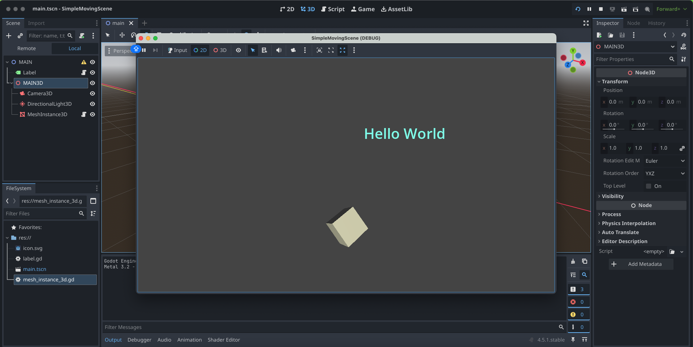

# SimpleScene Demo Week 1

This is a demonstrating a simple 2D and 3D scene with a moving node.  
It’s designed to learn basic scene setup, scripting, and movement in Godot.

# Week 2 Activity 1

This is a demonstrating a simple 2D and 3D scene with a moving node.  
It’s designed to learn basic scene setup, scripting, and movement in Godot.

